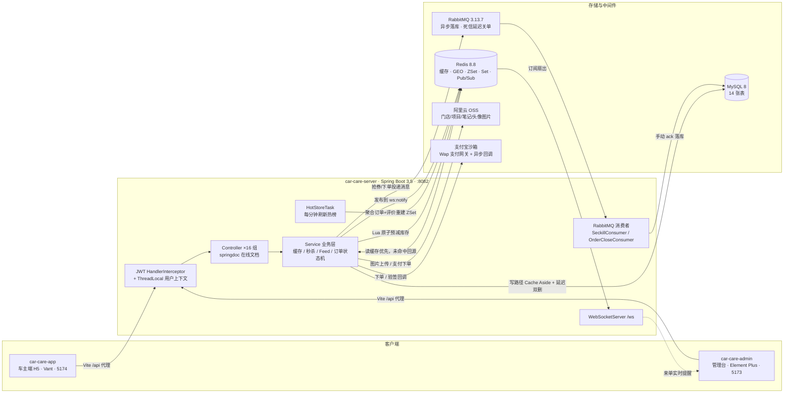

# 车管家 · 汽车维修保养服务平台

以「维修保养」为核心业务域的本地车主服务平台。**先跑通基础功能，再分阶段叠加缓存、消息、Feed 流等高价值技术点，每个技术点都做「方案对比 + 改进 + JMeter 压测数据」**，形成可量化的性能优化闭环。

- 后端：91 个类 / 4522 行 ｜ 前端：2308 行 ｜ 数据库：14 张表
- 技术点：Redis 缓存三件套、GEO 附近门店、Redis+Lua 秒杀、RabbitMQ 异步落库 + 死信延迟关单、推拉结合 Feed 流、号段发号、WebSocket + Redis Pub/Sub 集群通知、阿里云 OSS 图片上传、支付宝沙箱支付、用户头像、车主注册、车辆档案管理

---

## 一、项目结构

```
car-care/
├── PLAN.md                     # 实施计划书：阶段规划、压测数据、踩坑记录、简历条目
├── car-care-server/            # Spring Boot 3.5 + JDK17 单模块后端
├── car-care-admin/             # Vue3 + Vite + Element Plus 管理后台（5173）
├── car-care-app/               # Vue3 + Vite + Vant 车主端 H5（5174）
└── document/
    ├── sql/                    # 建表 SQL + 种子数据
    ├── jmeter/                 # JMeter 脚本 .jmx 与结果 .jtl
    ├── screenshots/            # 界面证据图
    ├── performance-report.md   # 全链路压测报告
    ├── SUMMARY.md              # 技术演进与踩坑复盘
    ├── LEARNING.md             # 学习文档（原理 + 代码定位 + 动手实验）
    ├── RESUME.md               # 简历条目（多版本 + 数字速查表）
    └── INTERVIEW.md            # 面试问答手册（15 专题带追问链）
```

后端包结构（`com.carcare`）：`config` 配置 ｜ `common` 统一响应与上下文 ｜ `controller` 20 组接口 ｜ `service` 业务 ｜ `mapper`+`entity`+`dto`+`vo` MyBatis-Plus 三件套 ｜ `websocket` 来单推送 ｜ `listener` MQ 消费者 ｜ `task` 定时任务 ｜ `utils`

---

## 二、架构



### 关键数据流

| 场景 | 链路 |
|---|---|
| 门店详情（读多写少） | 请求 → Redis 逻辑过期缓存 → 未命中 SETNX 互斥锁回源 → 延迟双删 |
| 附近门店 | 请求 → `cache:store:geo`（GeoHash+ZSet）→ 距离升序 → 阶段1缓存补详情 |
| 秒杀抢券 | 请求 → Redis+Lua 原子预减 → 发号 → 投递 MQ 立即返回 → 消费者手动 ack 落库 |
| 订单超时关单 | 下单 → 投递 `carcare.order.delay.queue`（队列级 TTL）→ 死信交换机 → 关单消费者按状态幂等 |
| Feed 流 | 发帖 → 推模式写扩散进粉丝收件箱 `feed:inbox:{uid}` → 超阈值切拉模式 → 查询双游标合并去重 |
| 来单提醒 | 新工单 → 发布 `ws:notify` → 各节点订阅 → 按角色投递 WebSocket 会话 |
| 图片上传 | 前端 multipart → `/api/upload` → 阿里云 OSS 按日期分片存储 → 返回 URL 落库（门店封面/项目图/笔记晒图/头像） |
| 订单支付 | 下单 → `/api/orders/{id}/pay` 返回支付宝沙箱收银台 URL → 付款 → 异步回调验签 → 状态机 1→2 幂等驱动 |

---

## 三、快速开始

### 依赖环境

JDK 17 ｜ Maven 3.9+ ｜ Node 24 ｜ MySQL 8 ｜ Redis（虚拟机 192.168.1.4:6379）｜ RabbitMQ 3.13.7（`D:\study_xue\RabbitMQ`）｜ 阿里云 OSS（AccessKey 见 `application.yml` 的 `carcare.alioss`）｜ 支付宝沙箱密钥（`carcare.pay.alipay`，沙箱 AppID/应用私钥/支付宝公钥，未配置时支付接口返回"支付下单失败"）｜ JMeter 5.6.3

### 启动步骤（重启电脑后按序执行）

```bash
# 0. 首次拉仓库：复制后端配置模板并填入自己的密钥
#    真实 application.yml 含 OSS/支付宝私钥/JWT secret，不入库（见 .gitignore）
cd car-care-server/src/main/resources && cp application.yml.example application.yml
#    编辑 application.yml 填入：MySQL 密码 / OSS 密钥 / 支付宝沙箱密钥 / JWT secret

# 1. MySQL（Windows 服务名是 MySQL，不是 MySQL80；MySQL80 是残留的未使用服务。
#        已开机自启则跳过。需管理员终端）
net start MySQL

# 2. RabbitMQ（先设两个环境变量）
set ERLANG_HOME=D:\study_xue\RabbitMQ\ErlangOTP
set RABBITMQ_BASE=D:\study_xue\RabbitMQ\root
D:\study_xue\RabbitMQ\rabbitmq_server-3.13.7\sbin\rabbitmq-server.bat

# 3. 建库（首次）：导入 document/sql/car_care.sql 与 phase2_seckill.sql

# 4. 后端 → :8082
cd car-care-server && mvn spring-boot:run

# 5. 管理台 → :5173    6. 车主端 → :5174
cd car-care-admin && npm run dev
cd car-care-app   && npm run dev
```

### 账号

| 账号 | 密码 | 用途 |
|---|---|---|
| `admin` | 123456 | 管理后台 |
| `user01` ~ `user30` | 123456 | 车主侧压测账号 |

RabbitMQ 管理台 `:15672` guest/guest；后端在线文档 `:8082/swagger-ui.html`。

---

## 四、阶段与成果

| 阶段 | 内容 | 核心成果 |
|---|---|---|
| 0 基础框架 | 14 表 + 核心 CRUD + 订单状态机 | 状态流转 1→5/2→3/3→4/4→6 校验生效 |
| 1 缓存体系 | 穿透/击穿/雪崩三件套 + 延迟双删 | **5000 请求 DB 查询 5001→1，降幅 99.98%** |
| 2 优惠券秒杀 | Redis+Lua 预减 + MQ 异步落库 + 号段发号 | **300 并发抢 20 库存，0 超卖 0 重复 0 丢失** |
| 3 附近门店+热榜 | Redis GEO + ZSet 定时刷新 | 距离计算与 `GEORADIUS` 原值一致 |
| 4 评价 Feed 流 | 推拉结合 + 双游标分页 | 翻页无重叠无丢失，双模式实测切换 |
| 5 用户端+工单提醒 | Vant 车主端 H5 + WebSocket 集群通知 | 前后端全链路打通 |
| 6 打磨 | 压测报告 + 文档 + 架构图 | 本仓库 |
| 7 上传+支付 | 阿里云 OSS 图片上传 + 支付宝沙箱支付 + 用户头像 + 车主注册 + 车辆档案管理 | 图片全链路（门店/项目/笔记/头像）；下单→沙箱收银台→异步回调驱动订单状态机；注册→登录闭环；车辆建档供下单选车 |

详细压测数据见 [`document/performance-report.md`](document/performance-report.md)；技术演进与踩坑复盘见 [`document/SUMMARY.md`](document/SUMMARY.md)；自学原理与动手实验见 [`document/LEARNING.md`](document/LEARNING.md)；简历条目与数字速查表见 [`document/RESUME.md`](document/RESUME.md)；面试问答手册见 [`document/INTERVIEW.md`](document/INTERVIEW.md)。

---

## 五、技术改进点（区别于常规实现的取舍）

| 点 | 常规做法 | 本项目的做法 | 理由 |
|---|---|---|---|
| 订单号 | UUID / 自增 | 号段模式 + 业务前缀 | 自增暴露业务量；UUID 无序影响索引。号段双缓冲 + 90% 异步预取消除取号毛刺 |
| 超时关单 | 定时任务扫全表 | RabbitMQ 死信队列 | DB 零空转扫描；关单精度 = 投递时刻 + TTL |
| 缓存一致性 | 只删缓存 | 延迟双删 + 兜底重查 | 防「读请求在写事务回滚前回填旧值」的经典竞态 |
| Feed | 单一推模式 | 推拉结合 | 大 V 粉丝过多写扩散成本失控，按粉丝阈值自动降级为拉模式 |
| 库存扣减 | 分布式锁 | Redis+Lua 原子脚本 | Lua 在 Redis 单线程内串行，天然无锁；唯一索引 + 条件 UPDATE 兜底 |

---

## 六、常见问题

- **Git Bash 里 curl 本地接口 502/超时**：本机有 7890 代理变量，必须加 `--noproxy '*'`
- **curl 请求体带中文报 400**：Git Bash 会转 GBK，测试统一用英文
- **重跑压测数据异常偏低**：`.jtl` 是**追加写**，重跑前必须删除旧文件
- **JMeter 目录**：`D:\study_xue\apache-jmeter-5.6.3\apache-jmeter-5.6.3\bin`（套了两层）

- **Vant 组件布局错乱**：Vant 4 已移除 `van-banner`、`van-avatar` 等组件，用它们**不报错**但会渲染成空自定义元素导致子内容错位。升级后执行 `ls node_modules/vant/es` 逐个核对；注意单判据不够——`van-form` 这类组件的渲染类名不叫 `.van-form`，需用「目录存在 + `es/index.mjs` 导出」双判据

- **RabbitMQ 未启动会不会导致后端崩掉？** 启动不会（3.5 秒正常起来，AMQP 连接是惰性的），但**进程最终会退出**。实测一个实例在 RabbitMQ 完全未启动的情况下跑了约 3 小时 17 分钟，累积 **4452 次** `AmqpConnectException` / `Failed to check/redeclare auto-delete queue(s)` 后以 exit code 1 终止。`SimpleMessageListenerContainer` 会持续重试重声明 auto-delete 队列，长期失败会导致上下文失败。要长时间开着后端就必须把 RabbitMQ 跑起来

  ```bash
  mvn spring-boot:run "-Dspring-boot.run.arguments=--spring.data.redis.host=192.168.1.4"
  ```
  注意 `--spring.xxx` 不能放进 `spring-boot.run.jvmArguments`——那是 JVM 参数位，JVM 会报 `Unrecognized option` 直接退出
