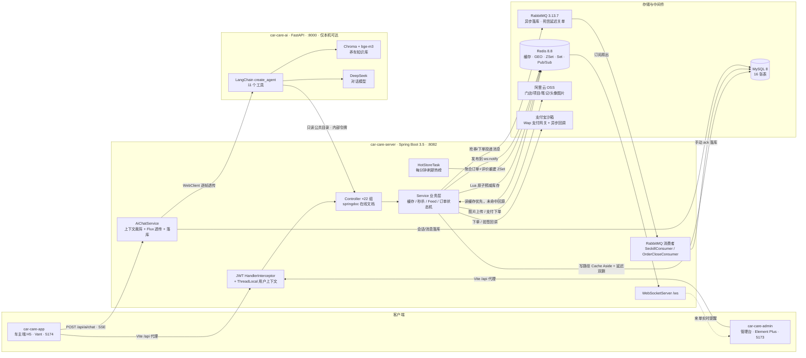

# 车管家 · 汽车维修保养服务平台

以「维修保养」为核心业务域的本地车主服务平台。**先跑通基础功能，再分阶段叠加缓存、消息、Feed 流等高价值技术点，每个技术点都做「方案对比 + 改进 + JMeter 压测数据」**，形成可量化的性能优化闭环。

- 后端：122 个类 / 6967 行 ｜ 车主端：3107 行 ｜ AI 服务：24 个文件 / 1817 行 ｜ 数据库：16 张表
- 技术点：Redis 缓存三件套、GEO 附近门店、Redis+Lua 秒杀、RabbitMQ 异步落库 + 死信延迟关单、推拉结合 Feed 流、号段发号、WebSocket + Redis Pub/Sub 集群通知、阿里云 OSS 图片上传、支付宝沙箱支付、用户头像、车主注册、车辆档案管理、**LangChain + FastAPI AI 养车顾问（SSE 流式、RAG、工具调用）**

---

## 一、项目结构

```
car-care/
├── PLAN.md                     # 实施计划书：阶段规划、压测数据、踩坑记录、简历条目
├── car-care-server/            # Spring Boot 3.5 + JDK17 单模块后端
├── car-care-ai/                # FastAPI + LangChain AI 养车顾问服务（8000，仅本机可达）
├── car-care-admin/             # Vue3 + Vite + Element Plus 管理后台（5173）
├── car-care-app/               # Vue3 + Vite + Vant 车主端 H5（5174）
└── document/
    ├── sql/                    # 建表 SQL + 种子数据
    ├── tools/                  # 排障脚本（SSE 事件观察器 sse_probe.py、AI 直连对照压测 ai_direct_load.py）
    ├── jmeter/                 # JMeter 脚本 .jmx 与结果 .jtl（含 AI 助手 SSE 并发脚本 ai-chat-test.jmx）
    ├── screenshots/            # 界面证据图
    ├── performance-report.md   # 全链路压测报告
    ├── AI-DESIGN.md            # AI 模块设计说明（架构决策 + 踩坑复盘）
    ├── AI-LEARNING.md          # AI 模块学习文档（原理 + 代码定位 + 动手实验）
    ├── SUMMARY.md              # 技术演进与踩坑复盘
    ├── LEARNING.md             # 学习文档（原理 + 代码定位 + 动手实验）
    ├── RESUME.md               # 简历条目（多版本 + 数字速查表）
    └── INTERVIEW.md            # 面试问答手册（15 专题带追问链）
```

后端包结构（`com.carcare`）：`config` 配置 ｜ `common` 统一响应与上下文 ｜ `controller` 22 组接口 ｜ `service` 业务 ｜ `client` AI 服务客户端 ｜ `mapper`+`entity`+`dto`+`vo` MyBatis-Plus 三件套 ｜ `websocket` 来单推送 ｜ `listener` MQ 消费者 ｜ `task` 定时任务 ｜ `utils`

---

## 二、架构


```mermaid
flowchart LR
    subgraph C[客户端]
        APP["car-care-app<br/>车主端 H5 · Vant · 5174"]
        ADM["car-care-admin<br/>管理台 · Element Plus · 5173"]
    end

    subgraph S[car-care-server · Spring Boot 3.5 · :8082]
        ITC["JWT HandlerInterceptor<br/>+ ThreadLocal 用户上下文"]
        CTL["Controller ×22 组<br/>springdoc 在线文档"]
        SVC["Service 业务层<br/>缓存 / 秒杀 / Feed / 订单状态机"]
        AIGW["AiChatService<br/>上下文裁剪 + Flux 透传 + 落库"]
        WS["WebSocketServer /ws"]
        LSN["RabbitMQ 消费者<br/>SeckillConsumer / OrderCloseConsumer"]
        TASK["HotStoreTask<br/>每分钟刷新热榜"]
    end

    subgraph AI[car-care-ai · FastAPI · :8000 · 仅本机可达]
        AGENT["LangChain create_agent<br/>11 个工具"]
        RAG["Chroma + bge-m3<br/>养车知识库"]
        LLM["DeepSeek<br/>对话模型"]
    end

    subgraph M[存储与中间件]
        DB[("MySQL 8<br/>16 张表")]
        RD[("Redis 8.8<br/>缓存 · GEO · ZSet · Set · Pub/Sub")]
        MQ["RabbitMQ 3.13.7<br/>异步落库 · 死信延迟关单"]
        OSS["阿里云 OSS<br/>门店/项目/笔记/头像图片"]
        ALI["支付宝沙箱<br/>Wap 支付网关 + 异步回调"]
    end

    APP -->|"Vite /api 代理"| ITC
    ADM -->|"Vite /api 代理"| ITC
    ITC --> CTL --> SVC

    SVC <-->|"读缓存优先，未命中回源"| RD
    SVC -->|"写路径 Cache Aside + 延迟双删"| DB
    SVC -->|"Lua 原子预减库存"| RD
    SVC -->|"抢券/下单投递消息"| MQ
    SVC -->|"图片上传 / 支付下单"| OSS
    SVC -->|"下单 / 验签回调"| ALI
    MQ --> LSN -->|"手动 ack 落库"| DB
    TASK -->|"聚合订单+评价重建 ZSet"| RD
    SVC -->|"发布到 ws:notify"| RD
    RD -->|"订阅扇出"| WS
    WS -.->|"来单实时提醒"| ADM

    APP -->|"POST /api/ai/chat · SSE"| AIGW
    AIGW -->|"WebClient 逐帧透传"| AGENT
    AIGW -->|"会话/消息落库"| DB
    AGENT --> LLM
    AGENT --> RAG
    AGENT -->|"只读公共目录 · 内部令牌"| CTL
```

### 关键数据流

| 场景 | 链路 |
|---|---|
| 门店详情（读多写少） | 请求 → Redis 逻辑过期缓存 → 未命中 SETNX 互斥锁回源 → 延迟双删 |
| 附近门店 | 请求 → `cache:store:geo`（GeoHash+ZSet）→ 距离升序 → 阶段1缓存补详情 |
| 秒杀抢券 | 请求 → Redis+Lua 原子预减 → 发号 → 投递 MQ 立即返回 → 消费者手动 ack 落库 |
| 订单超时关单 | 下单 → 投递 `carcare.order.delay.queue`（队列级 TTL）→ 死信交换机 → 关单消费者按状态幂等 |
| Feed 流 | 发帖 → 推模式写扩散进粉丝收件箱 `feed:inbox:{uid}` → 超阈值切拉模式 → 查询双游标合并去重 |
| 来单提醒 | 新工单 → 发布 `ws:notify` → 各节点订阅 → 按角色投递 WebSocket 会话 |
| 图片上传 | 前端 multipart → `/api/upload` → 阿里云 OSS 按日期分片存储 → 返回 URL 落库（门店封面/项目图/笔记晒图/头像） |
| 订单支付 | 下单 → `/api/orders/{id}/pay` 返回支付宝沙箱收银台 URL → 付款 → 异步回调验签 → 状态机 1→2 幂等驱动 |
| AI 养车顾问 | 前端 SSE → Java 校验 JWT + 裁剪用户上下文 → WebClient 调 Python → LangChain Agent 按需调工具（内部接口查目录 / 读下发上下文 / 查向量库）→ 逐帧回传 `delta`/`tool_*`/`draft` → Java 收尾异步落库 |
| AI 预约草稿 | 用户说「帮我约 X 店的小保养」→ Agent 查门店+项目+车辆 → 产出结构化草稿卡片 → 用户点确认 → 跳既有 `/order-create` 预填 → 走正常下单链路（AI 不写库） |

---

## 三、快速开始

### 依赖环境

JDK 17 ｜ Maven 3.9+ ｜ Node 24 ｜ **Python 3.11+** ｜ MySQL 8 ｜ Redis（虚拟机 192.168.1.4:6379）｜ RabbitMQ 3.13.7（`D:\study_xue\RabbitMQ`）｜ 阿里云 OSS（AccessKey 见 `application.yml` 的 `carcare.alioss`）｜ 支付宝沙箱密钥（`carcare.pay.alipay`，沙箱 AppID/应用私钥/支付宝公钥，未配置时支付接口返回"支付下单失败"）｜ JMeter 5.6.3 ｜ DeepSeek 密钥 + SiliconFlow 密钥（AI 模块，未配置时 AI 功能不可用但不影响主链路）

### 启动步骤（重启电脑后按序执行）

```bash
# 0. 首次拉仓库：复制后端配置模板并填入自己的密钥
#    真实 application.yml 含 OSS/支付宝私钥/JWT secret，不入库（见 .gitignore）
cd car-care-server/src/main/resources && cp application.yml.example application.yml
#    编辑 application.yml 填入：MySQL 密码 / OSS 密钥 / 支付宝沙箱密钥 / JWT secret
#    若要用 AI 助手，还要填 carcare.ai.internal-token（与下一步的 CARCARE_INTERNAL_TOKEN 一致）

# 1. MySQL（Windows 服务名是 MySQL，不是 MySQL80；MySQL80 是残留的未使用服务。
#        已开机自启则跳过。需管理员终端）
net start MySQL

# 2. RabbitMQ（先设两个环境变量）
set ERLANG_HOME=D:\study_xue\RabbitMQ\ErlangOTP
set RABBITMQ_BASE=D:\study_xue\RabbitMQ\root
D:\study_xue\RabbitMQ\rabbitmq_server-3.13.7\sbin\rabbitmq-server.bat

# 3. 建库（首次）：导入 document/sql/car_care.sql、phase2_seckill.sql 与 phase3_ai.sql

# 4. AI 服务 → :8000（可选，只用主链路可跳过；起不来时后端 AI 接口会降级提示，不影响下单）
cd car-care-ai
python -m pip install -r requirements.txt
cp .env.example .env       # 填 LLM_API_KEY / EMBEDDING_API_KEY / CARCARE_INTERNAL_TOKEN
python -m uvicorn app.main:app --host 127.0.0.1 --port 8000

# 5. 后端 → :8082
cd car-care-server && mvn spring-boot:run

# 6. 管理台 → :5173    7. 车主端 → :5174
cd car-care-admin && npm run dev
cd car-care-app   && npm run dev
```

AI 助手的排障脚本（直接观察 SSE 每一帧事件，绕过前端）：

```bash
python document/tools/sse_probe.py -q "杭州有哪些门店？"
python document/tools/sse_probe.py -q "这个价格包含机滤吗？" -s <上一步输出的 sessionId>   # 多轮
```

### 账号

| 账号 | 密码 | 用途 |
|---|---|---|
| `admin` | 123456 | 管理后台 |
| `user01` ~ `user30` | 123456 | 车主侧压测账号 |

RabbitMQ 管理台 `:15672` guest/guest；后端在线文档 `:8082/swagger-ui.html`。

---

## 四、阶段与成果

| 阶段 | 内容 | 核心成果 |
|---|---|---|
| 0 基础框架 | 14 表 + 核心 CRUD + 订单状态机 | 状态流转 1→5/2→3/3→4/4→6 校验生效 |
| 1 缓存体系 | 穿透/击穿/雪崩三件套 + 延迟双删 | **5000 请求 DB 查询 5001→1，降幅 99.98%** |
| 2 优惠券秒杀 | Redis+Lua 预减 + MQ 异步落库 + 号段发号 | **300 并发抢 20 库存，0 超卖 0 重复 0 丢失** |
| 3 附近门店+热榜 | Redis GEO + ZSet 定时刷新 | 距离计算与 `GEORADIUS` 原值一致 |
| 4 评价 Feed 流 | 推拉结合 + 双游标分页 + 订单评价闭环 | 翻页无重叠无丢失，双模式实测切换；评价回写订单 4→6 并重算门店均分 |
| 5 用户端+工单提醒 | Vant 车主端 H5 + WebSocket 集群通知 | 前后端全链路打通 |
| 6 打磨 | 压测报告 + 文档 + 架构图 | 本仓库 |
| 7 上传+支付 | 阿里云 OSS 图片上传 + 支付宝沙箱支付 + 用户头像 + 车主注册 + 车辆档案管理 | 图片全链路（门店/项目/笔记/头像）；下单→沙箱收银台→异步回调驱动订单状态机；注册→登录闭环；车辆建档供下单选车 |
| 8 AI 助手 | FastAPI + LangChain Agent（11 工具）+ Chroma RAG + SSE 流式 + 预约草稿 | **Java 唯一网关、AI 服务无状态**；用户私有数据按 JWT 身份裁剪下发，越权在结构上不成立（7 条越权路径实测全部拦截）；AI 服务挂掉不影响下单支付；100 并发 SSE 长连接 **0 断流 0 丢失**，瓶颈实测定位于上游模型而非本服务 |

详细压测数据见 [`document/performance-report.md`](document/performance-report.md)；技术演进与踩坑复盘见 [`document/SUMMARY.md`](document/SUMMARY.md)；AI 模块架构决策与踩坑见 [`document/AI-DESIGN.md`](document/AI-DESIGN.md) 与 [`car-care-ai/README.md`](car-care-ai/README.md)；自学原理与动手实验见 [`document/LEARNING.md`](document/LEARNING.md)（AI 模块单独一份：[`document/AI-LEARNING.md`](document/AI-LEARNING.md)）；简历条目与数字速查表见 [`document/RESUME.md`](document/RESUME.md)；面试问答手册见 [`document/INTERVIEW.md`](document/INTERVIEW.md)。

---

## 五、技术改进点（区别于常规实现的取舍）

| 点 | 常规做法 | 本项目的做法 | 理由 |
|---|---|---|---|
| 订单号 | UUID / 自增 | 号段模式 + 业务前缀 | 自增暴露业务量；UUID 无序影响索引。号段预取下一段 + 90% 异步触发消除取号毛刺 |
| 超时关单 | 定时任务扫全表 | RabbitMQ 死信队列 | DB 零空转扫描；关单精度 = 投递时刻 + TTL |
| 缓存一致性 | 只删缓存 | 延迟双删 + 兜底重查 | 防「读请求在删缓存后回填旧值」的经典竞态 |
| Feed | 单一推模式 | 推拉结合 | 大 V 粉丝过多写扩散成本失控，按粉丝阈值自动降级为拉模式 |
| 库存扣减 | 分布式锁 | Redis+Lua 原子脚本 | Lua 在 Redis 单线程内串行，天然无锁；唯一索引 + 条件 UPDATE 兜底 |
| AI 服务鉴权 | 前端直连 Python | Java 作为唯一网关，Python 只绑 127.0.0.1 + 内部令牌 | 避免在 Python 侧重做一遍鉴权/CORS/限流；两套鉴权的失效边界很难对齐 |
| AI 用户数据 | Python 按 userId 查库 | Java 按 JWT 身份裁剪后随请求下发 | AI 服务没有「按 userId 查数据」的入口，越权在结构上不成立（而非依赖校验逻辑正确） |
| AI 会话存储 | LangGraph checkpointer | Java 的 MySQL，Python 无状态 | 会话归属复用 userId 只有一处判断；Python 可随时重启/扩容，不需要会话粘性 |
| AI 预约下单 | AI 直接写库下单 | AI 只产出草稿，用户确认后走既有下单接口 | 订单状态机、延迟关单、优惠券核销已在 Java 沉淀，复制一份到 Python 会带来两边状态不一致 |
| 工具调用过渡语 | 攒完整段再推 / 直接透传 | 透传 + `reset` 事件让前端清掉 | 前者首字延迟 = 完整生成时间；后者会把「让我查一下」留在最终回答里 |

---

## 六、常见问题

- **Git Bash 里 curl 本地接口 502/超时**：本机有 7890 代理变量，必须加 `--noproxy '*'`
- **curl 请求体带中文报 400**：Git Bash 会转 GBK，测试统一用英文。**AI 对话接口没法用英文测**（问的是中文业务问题），
  解法是把请求体写进 UTF-8 文件再 `--data-binary @file.json`，或用 `document/tools/sse_probe.py`
- **curl 看 SSE 必须加 `-N`**：不加会等整个响应缓冲完才输出，看起来像「不是流式」
- **AI 接口报 422 但不知道哪个字段错**：`app/main.py` 里加了 `RequestValidationError` 处理器，
  会把错误字段和原始请求体打进日志。曾经靠它定位到「`LocalDateTime` 被序列化成 `[2026,10,20]` 数组」
- **加 webflux 后担心 Tomcat 被换掉**：不会。`spring-boot-starter-web` 同时存在时 Spring Boot 判定为 SERVLET 应用，
  WebFlux 只提供 `WebClient`，不接管请求处理
- **重跑压测数据异常偏低**：`.jtl` 是**追加写**，重跑前必须删除旧文件
- **Git Bash 里 JMeter 参数被悄悄改掉**：MSYS 路径转换会把 `-Jpath=/v1/chat` 改写成
  `D:/study_xue/Git/v1/chat`，请求 404 且**不报参数错误**，只看 JMeter 汇总会误判成服务问题。
  在 Git Bash 里跑要加 `MSYS_NO_PATHCONV=1`，或改用 cmd。同理，命令行传中文会被 Git Bash 与 JVM
  二次编码，**中文问题要用 JSON 原生的 `\uXXXX` 转义形式**传（`-Jquestion='\u676d\u5dde...'`）
- **JMeter 压测 AI 接口要注意**：RT 大头是上游大模型（实测 1.1s → 并发下 2.6s），
  **绝对数字会随上游负载漂移，跨天对比无意义**；要比较两个方案的差异必须同批次交替跑。
  另外每次压测会真实消耗 token，按 50 并发 × 1 轮 ≈ 15 万 input token 估费用
- **混编码日志里 grep 会静默不匹配（踩过两次）**：Spring 日志混了 GBK 字节，`grep` 对**重定向出来的文件**
  会按二进制处理，**静默返回空且不报错**，极易误判成「没有错误日志」「测试全过」。这个环境的 `grep`
  还是个 shell 函数包装，行为与 `/usr/bin/grep` 不完全一致。
  **区分**：`mvn test 2>&1 | grep xxx`（走管道）是正常的；`mvn test > x.log` 再 `grep xxx x.log`（读文件）
  会被吞掉。判测试结果、判错误日志一律**用 Python 读**（`grep -a` 也可，但不保险）
- **JMeter 目录**：`D:\study_xue\apache-jmeter-5.6.3\apache-jmeter-5.6.3\bin`（套了两层）

- **Vant 组件布局错乱**：Vant 4 已移除 `van-banner`、`van-avatar` 等组件，用它们**不报错**但会渲染成空自定义元素导致子内容错位。升级后执行 `ls node_modules/vant/es` 逐个核对；注意单判据不够——`van-form` 这类组件的渲染类名不叫 `.van-form`，需用「目录存在 + `es/index.mjs` 导出」双判据

- **RabbitMQ 未启动会不会导致后端崩掉？** 启动不会（3.5 秒正常起来，AMQP 连接是惰性的），但**进程最终会退出**。实测一个实例在 RabbitMQ 完全未启动的情况下跑了约 3 小时 17 分钟，累积 **4452 次** `AmqpConnectException` / `Failed to check/redeclare auto-delete queue(s)` 后以 exit code 1 终止。`SimpleMessageListenerContainer` 会持续重试重声明 auto-delete 队列，长期失败会导致上下文失败。要长时间开着后端就必须把 RabbitMQ 跑起来

  ```bash
  mvn spring-boot:run "-Dspring-boot.run.arguments=--spring.data.redis.host=192.168.1.4"
  ```
  注意 `--spring.xxx` 不能放进 `spring-boot.run.jvmArguments`——那是 JVM 参数位，JVM 会报 `Unrecognized option` 直接退出
